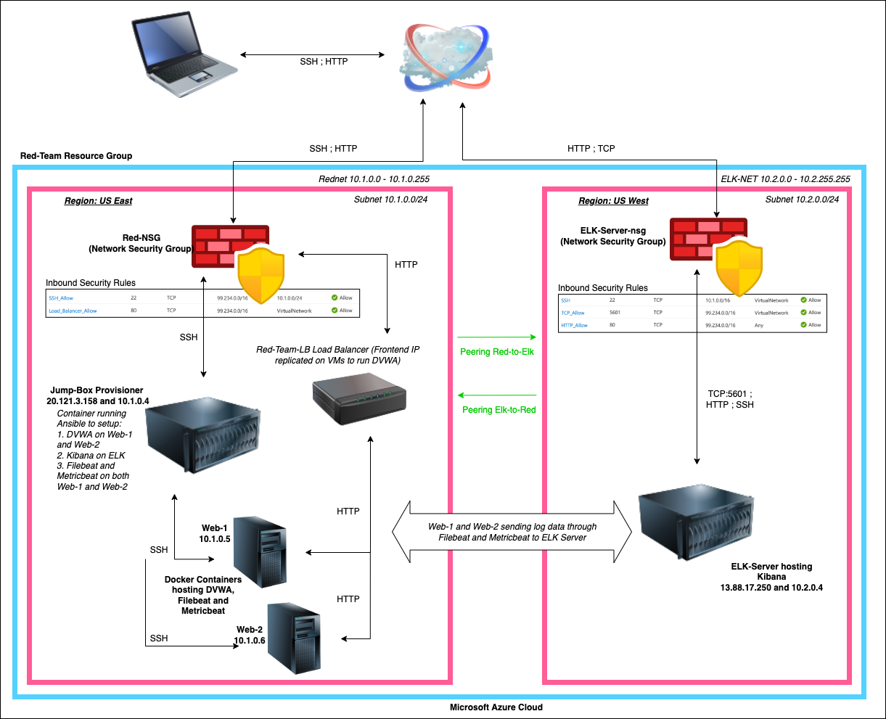

## Automated ELK Stack Deployment

The files in this repository were used to configure the network depicted below.

These files have been tested and used to generate a live ELK deployment on Azure. They can be used to either recreate the entire deployment pictured above. Alternatively, select portions of the Yml files may be used to install only certain pieces of it, such as Filebeat.

YML files referenced here:

[DVWA installation](https://github.com/alishababbar13/CSBootCampt/blob/ffd5649f8ce560b493debba4d1ef21c684fec786/Ansible/DVWA-Installation.yml)

[ELK installation](https://github.com/alishababbar13/CSBootCampt/blob/ffd5649f8ce560b493debba4d1ef21c684fec786/Ansible/ELK-Installation.yml)

[Filebeat Playbook](https://github.com/alishababbar13/CSBootCampt/blob/f410143f2f4ac7a3a8561f0d6a5c9b8ba9e4b185/Ansible/roles/filebeat-playbook.yml)

[Metric Playbook](https://github.com/alishababbar13/CSBootCampt/blob/ffd5649f8ce560b493debba4d1ef21c684fec786/Ansible/roles/metricbeat-playbook.yml)

This document contains the following details:
- Description of the Topologu\y
- Access Policies
- ELK Configuration
  - Beats in Use
  - Machines Being Monitored
- How to Use the Ansible Build

### Description of the Topology

The main purpose of this network is to expose a load-balanced and monitored instance of DVWA, the D*mn Vulnerable Web Application.

Load balancing ensures that the application will be highly available, in addition to restricting access to the network.
- Load Balancers act as a reverse proxy and distributes network or application traffic across a number of servers. Load balancers are used to increase capacity (concurrent users) and reliability of applications. They improve the overall performance of applications by decreasing the burden on servers associated with managing and maintaining application and network sessions, as well as by performing application-specific tasks.
- A jump box is a secure computer that all admins first connect to before launching any administrative task or use as an origination point to connect to other servers or untrusted environments.

Integrating an ELK server allows users to easily monitor the vulnerable VMs for changes to the **files** and system **metrics**.
- Filebeat watches for the changes in the files in the locations that we specify or the log files and then collects and send the data to logstash/elasticsearch.
- Metricbeat collects the metric data from the services and the operating system and sends it to logstash/elasticsearch

The configuration details of each machine may be found below.
_Note: Use the [Markdown Table Generator](http://www.tablesgenerator.com/markdown_tables) to add/remove values from the table_.

| Name     | Function | IP Address | Operating System |
|----------|----------|------------|------------------|
| Jump Box | Gateway with ansible container |40.121.104.252| Ubuntu 18.04 Server LTS |
| Web-1    | Hosts DVWA Container Contains Filebeat and Metricbeat| 10.1.0.5 |  Ubuntu 18.04 Server LTS |
| Web-2    | Hosts DVWA Container Contains Filebeat and Metricbeat (backup) | 10.1.0.6 | Ubuntu 18.04 Server LTS |
| ELK-Sever | Hosts Elk stack container| 52.180.67.235  private ip 10.2.0.4 |  Ubuntu 18.04 Server LTS |

### Access Policies

The machines on the internal network are not exposed to the public Internet. 

Only the **Jumpbox** machine can accept connections from the Internet. Access to this machine is only allowed from the following IP addresses:
- _TODO: Add whitelisted IP addresses_

Machines within the network can only be accessed by _____.
- _TODO: Which machine did you allow to access your ELK VM? What was its IP address?_

A summary of the access policies in place can be found in the table below.

| Name     | Publicly Accessible | Allowed IP Addresses |
|----------|---------------------|----------------------|
| Jump Box | Yes/No              | 10.0.0.1 10.0.0.2    |
|          |                     |                      |
|          |                     |                      |

### Elk Configuration

Ansible was used to automate configuration of the ELK machine. No configuration was performed manually, which is advantageous because...
- _TODO: What is the main advantage of automating configuration with Ansible?_

The playbook implements the following tasks:
- _TODO: In 3-5 bullets, explain the steps of the ELK installation play. E.g., install Docker; download image; etc._
- ...
- ...

The following screenshot displays the result of running `docker ps` after successfully configuring the ELK instance.

### Target Machines & Beats
This ELK server is configured to monitor the following machines:
- _TODO: List the IP addresses of the machines you are monitoring_

We have installed the following Beats on these machines:
- _TODO: Specify which Beats you successfully installed_

These Beats allow us to collect the following information from each machine:
- _TODO: In 1-2 sentences, explain what kind of data each beat collects, and provide 1 example of what you expect to see. E.g., `Winlogbeat` collects Windows logs, which we use to track user logon events, etc._

### Using the Playbook
In order to use the playbook, you will need to have an Ansible control node already configured. Assuming you have such a control node provisioned: 

SSH into the control node and follow the steps below:
- Copy the _____ file to _____.
- Update the _____ file to include...
- Run the playbook, and navigate to ____ to check that the installation worked as expected.

_TODO: Answer the following questions to fill in the blanks:_
- _Which file is the playbook? Where do you copy it?_
- _Which file do you update to make Ansible run the playbook on a specific machine? How do I specify which machine to install the ELK server on versus which to install Filebeat on?_
- _Which URL do you navigate to in order to check that the ELK server is running?

_As a **Bonus**, provide the specific commands the user will need to run to download the playbook, update the files, etc._
